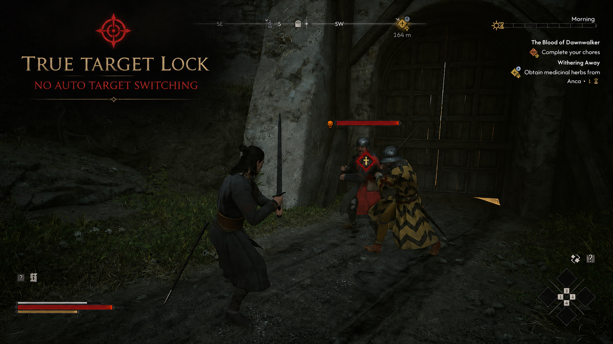

# True Target Lock for The Blood of Dawnwalker



A small UE4SS Lua mod that stops ordinary mouse movement from changing the
selected enemy while hard lock is active.

## What it changes

The game routes mouse movement through `SwitchLockTarget` and marks it as an
allowed hard-lock switch. This mod changes only that dedicated call parameter.

It does not modify attacks, blocks, initial target selection, non-mouse target
controls, combat exit, or target-death handling.

## Tested build

- Store: GOG
- Game build: `dw1-pc-gog-257186-shipping-patch2-all-CL-257186`
- UE4SS: `v3.0.1-1111-g97b7e501`

## Installation

1. Install UE4SS for The Blood of Dawnwalker.
2. Copy the `TrueTargetLock` folder to `ue4ss/Mods/`.
3. Add this line to `ue4ss/Mods/mods.txt`:

```text
TrueTargetLock : 1
```

Restart the game. If UE4SS hot reload is enabled, `Ctrl+R` can reload the mod
without restarting.

## Uninstallation

Remove `TrueTargetLock : 1` from `ue4ss/Mods/mods.txt`, then delete the
`ue4ss/Mods/TrueTargetLock` folder.

## Status

Initial proof-of-concept. Confirmed in combat with multiple enemies on the GOG
Patch 2 build: mouse movement no longer changes a hard-locked target.

## Community

Join the community on [Discord](https://discord.gg/7S7CfzbXkh).

## Support

If you want to support future work, visit [Second Player on Patreon](https://www.patreon.com/cw/Second_Player).
